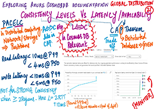

  <h1>Understanding Cosmosdb documentation</h1>
    
Sketch notes to easily understand and illustrates the concepts of <b> <a href="https://azure.microsoft.com/en-us/services/cosmos-db/">Azure Cosmos DB</a></b> to empower anyone to build stuff on Cosmos DB.  
      <mark><b>Click on each image to see the large image and the details.</b></mark>
         Follow Cosmos DB on Twitter <a href="https://twitter.com/AzureCosmosDB"><b>@AzureCosmosDB</b></a> and <a href="https://stackoverflow.com/questions/tagged/azure-cosmosdb"><b>StackOverflow</b></a>.

    

<table>
   
   <td align="center" valign="center">
        
         
        <b>(1) <i>Understanding Azure Cosmos DB Documentation </i></b>
      </td>
 <td align="center" valign="center">
        
         
        <b>(2) <i>Create Account, Database and Container : Portal @AzureCosmosDB </i></b>
  <td align="center" valign="center">
        
         
        <b>(3) <i>Create Account, Database and Container on Portal </i></b>
      </td>
  </tr>
    
  </tr>
  <tr>
   <td align="center" valign="center">
        
         
        <b>(4) <i>Create Account, Database and Container : ARM</i></b>
      </td>
 <td align="center" valign="center">
        
         
        <b>(5) <i>.NET v4 @AzureCosmosDB </i></b>
  <td align="center" valign="center">
        
         
        <b>(6) <i>.NET V3 Stable SDK version @AzureCosmosDB</i></b>
      </td>
  </tr>
    
  </tr>
  <tr>
   <td align="center" valign="center">
        
         
        <b>(7) <i>Point Read Vs Query</i></b>
      </td>
 <td align="center" valign="center">
        
         
        <b>(8) <i>zure Cosmos DB Docs - Java v4 QuickStarts</i></b>
  <td align="center" valign="center">
        
         
        <b>(9) <i>Azure Cosmos DB Docs - Java v4 QuickStarts Contd</i></b>
      </td>
  </tr>
    <tr>
   <td align="center" valign="center">
        
         
        <b>(10) <i>Azure Cosmos DB Docs -JavaScript QuickStart</i></b>
      </td>
 <td align="center" valign="center">
        
         
        <b>(11) <i>Azure Cosmos DB Docs - JavaScript QuickStarts Contd</i></b>
  <td align="center" valign="center">
        
         
        <b>(12) <i>Scalability && Availability</i></b>
      </td>
  </tr>
     <tr>
   <td align="center" valign="center">
        
         
        <b>(13) <i>Global Data Distribution</i></b>
      </td>
 <td align="center" valign="center">
        
         
        <b>(14) <i>Consistency levels :  Bounded Staleness </i></b>
  <td align="center" valign="center">
        
         
        <b>(15) <i>Consistency levels :  Session Consistency</i></b>
      </td>
  </tr>
  <tr>
  <td align="center" valign="center">
        
         
        <b>(16) <i>Consistency levels :  Consistent prefix</i></b>
      </td>
 <td align="center" valign="center">
        
         
        <b>(17) <i>Consistency levels :  Bounded Staleness </i></b>
  <td align="center" valign="center">
        
         
        <b>(18) <i>CApache Cassandra vs Azure Cosmos DB Cassandra API Consistency mapping</i></b>
      </td>
  </tr>
   <tr>
  <td align="center" valign="center">
        
         
        <b>(19) <i>Apache Cassandra vs Azure Cosmos DB Cassandra API Lower Writes Consistency mapping</i></b>
      </td>
 <td align="center" valign="center">
        
         
        <b>(20) <i>Mongo DB vs Azure Cosmos DB Mongo API Majority Write Consistency mapping </i></b>
  <td align="center" valign="center">
        
         
        <b>(21) <i>Mongo DB vs Azure Cosmos DB Mongo API Minority Write Consistency mapping</i></b>
      </td>
  </tr>
   <tr>
  <td align="center" valign="center">
        
         
        <b>(22) <i>Cosmos DB Consistency Vs Latency Trade Offs</i></b>
      </td>
 <td align="center" valign="center">
        
         
        <b>(23) <i>Cosmos DB Consistency Vs Throughput tradeoffs </i></b>
  <td align="center" valign="center">
        
         
        <b>(24) <i>Cosmos DB Documentation : Consistency Levels & Data Durability trade Offs</i></b>
      </td>
  </tr>
     <tr>
  <td align="center" valign="center">
        
         
        <b>(25) <i> : Zone Availability Supported </i></b>
      </td>
 <td align="center" valign="center">
        
         
        <b>(26) <i>Tips for High Availability </i></b>
   
  </tr>
 </table>